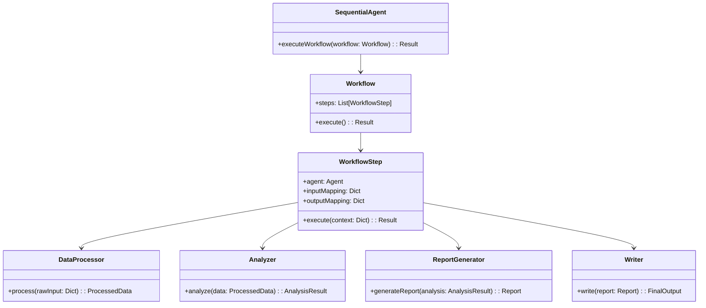

# 回旋镖式多代理工作流架构设计

## 架构概述
基于ADK指南设计的回旋镖式多代理工作流，包含以下核心组件：
- **SequentialAgent**: 主编排器，负责工作流执行
- **DataProcessor**: 处理原始数据输入
- **Analyzer**: 分析处理后的数据
- **ReportGenerator**: 生成结构化报告
- **Writer**: 最终内容生成

## 架构图


## 关键类设计

### SequentialAgent (主编排器)
```python
class SequentialAgent:
    def __init__(self, workflow_config):
        self.workflow = self._build_workflow(workflow_config)
        
    def _build_workflow(self, config):
        # 根据配置构建工作流步骤
        pass
        
    def execute(self, input_data):
        context = {"input": input_data}
        for step in self.workflow.steps:
            result = step.execute(context)
            context.update(result.outputs)
        return context["final_output"]
```

### DataProcessor (数据处理代理)
```python
class DataProcessor(Agent):
    def __init__(self):
        self.validator = StoryInputValidator()
        
    def process(self, raw_input):
        # 验证和标准化输入数据
        validated = self.validator.validate(raw_input)
        return {
            "plot": validated.plot,
            "characters": [c.dict() for c in validated.characters],
            "style": validated.style_preferences.dict()
        }
```

### Analyzer (分析代理)
```python
class Analyzer(Agent):
    def __init__(self):
        self.style_analyzer = StyleAnalyzer()
        
    def analyze(self, processed_data):
        # 分析风格一致性等
        return {
            "style_analysis": self.style_analyzer.analyze(
                processed_data["content"],
                processed_data["style"]
            ),
            "coherence_score": self._calculate_coherence(processed_data)
        }
```

### ReportGenerator (报告生成代理)
```python
class ReportGenerator(Agent):
    def generate(self, analysis_result):
        # 生成结构化报告
        return {
            "summary": self._generate_summary(analysis_result),
            "recommendations": self._generate_recommendations(analysis_result),
            "metrics": analysis_result["metrics"]
        }
```

### Writer (写作代理)
```python
class Writer(Agent):
    def __init__(self, model):
        self.engine = WritingEngine(model)
        
    def write(self, report):
        # 生成最终内容
        return self.engine.generate(report)
```

## 工作流说明
1. DataProcessor处理原始输入后，将结果传递给Analyzer
2. Analyzer分析后可以返回中间结果给DataProcessor进行修正
3. 修正后的数据再次进入Analyzer进行验证
4. 验证通过后进入ReportGenerator生成报告
5. 最终报告由Writer生成最终输出